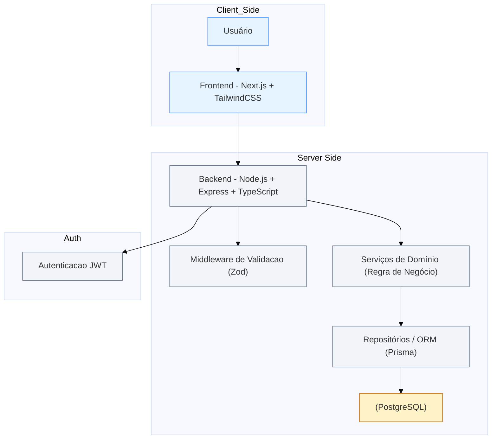

# Arquitetura — Plataforma de Gestão para Grupos de Networking

> Documento de Arquitetura para o teste técnico — Projeto: Plataforma de Gestão para Grupos de Networking

---

## Sumário

- Visão Geral
- Diagrama da Arquitetura (Mermaid)
- Escolha de tecnologias e justificativa
- Modelo de Dados (esquema relacional sugestão)
- Estrutura de Componentes (Frontend — Next.js / React)
- Definição da API (endpoints principais, request/response)
- Autenticação, autorização e segurança
- Persistência, arquivos e integrações
- Testes, CI/CD e observabilidade
- Roadmap de implementação (MVP + extras)

---

## Visão Geral

A plataforma centraliza gestão de membros, comunicação, controle de presença, geração de negócios entre membros, acompanhamento 1:1 e módulo financeiro de mensalidades. A arquitetura proposta é **modular**, **escalável** e facilita iterações rápidas — com backend em Node.js (TypeScript), API REST (ou GraphQL opcional), frontend em Next.js (React), banco relacional (Postgres) e armazenamento de arquivos em S3-compatible.

Principais princípios:

- Contratos bem definidos (OpenAPI) para facilitar front/back independentes.
- Controle de acessos por roles (admin, member, guest).
- Modelagem relacional por tratar-se de domínio com muitas relações (membros, indicações, reuniões, pagamentos).
- Testes automáticos (unit + integração) e pipeline CI simples.

---

## Diagrama da Arquitetura

---
