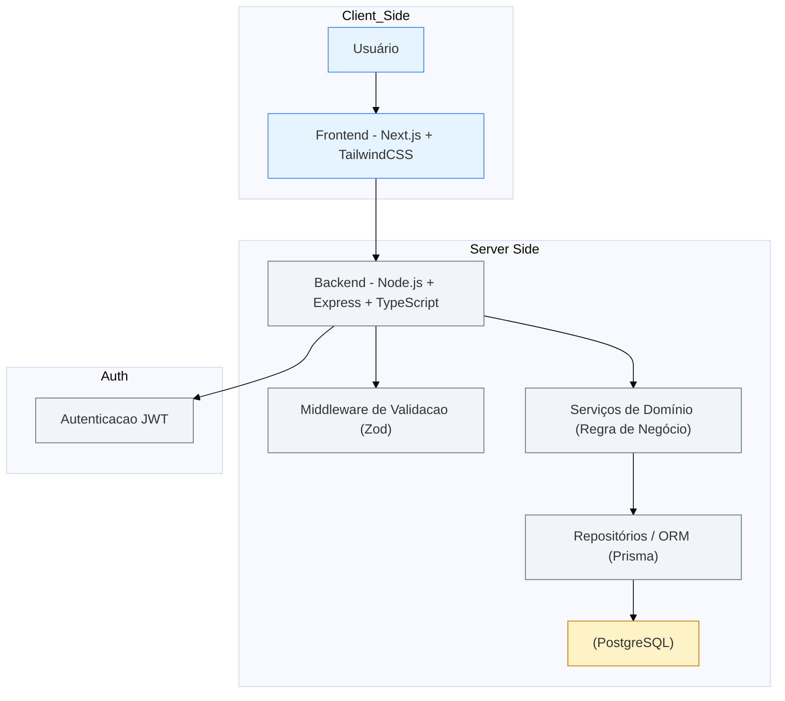

# Arquitetura — Plataforma de Gestão para Grupos de Networking

> Documento de Arquitetura para o teste técnico — Projeto: Plataforma de Gestão para Grupos de Networking

---

## Sumário

- Visão Geral
- Diagrama da Arquitetura (Mermaid)
- Escolha de tecnologias e justificativa
- Modelo de Dados (esquema relacional sugestão)
- Estrutura de Componentes (Frontend — Next.js / React)
- Definição da API (endpoints principais, request/response)
- Autenticação, autorização e segurança
- Persistência, arquivos e integrações
- Testes, CI/CD e observabilidade
- Roadmap de implementação (MVP + extras)

---

## Visão Geral

A plataforma tem como objetivo centralizar a **gestão de membros, comunicação interna, controle de presença, geração de negócios entre membros, acompanhamento de reuniões 1:1 e o módulo financeiro de mensalidades**.

A arquitetura proposta é **modular**, **escalável** e de fácil manutenção, permitindo evolução incremental e iterações rápidas.  
A solução será composta por:

- **Backend:** Node.js + Express com TypeScript
- **API:** REST (documentada com OpenAPI/Swagger)
- **Frontend:** Next.js (React) com Tailwind CSS
- **Banco de dados:** PostgreSQL (relacional)
- **Infraestrutura local:** ambiente Docker com containers para backend e banco de dados
- **Hospedagem:** frontend na Vercel e backend containerizado em ambiente cloud (ex.: Render, Railway ou ECS)

### Princípios

- **Clean Architecture e SOLID:** separação clara de camadas e responsabilidades.
- **Contratos bem definidos:** OpenAPI para comunicação padronizada entre frontend e backend.
- **Controle de acesso baseado em roles:** (admin, member, guest).
- **Modelagem relacional:** adequada ao domínio com múltiplos relacionamentos (membros, reuniões, indicações, pagamentos).
- **Testes automatizados:** unitários e de integração com Jest e Supertest.
- **Padronização visual:** uso de Tailwind CSS para consistência e manutenibilidade no frontend.
- **Validação de entradas:** via Zod, garantindo integridade e segurança nos endpoints.

---

## Diagrama da Arquitetura

---
