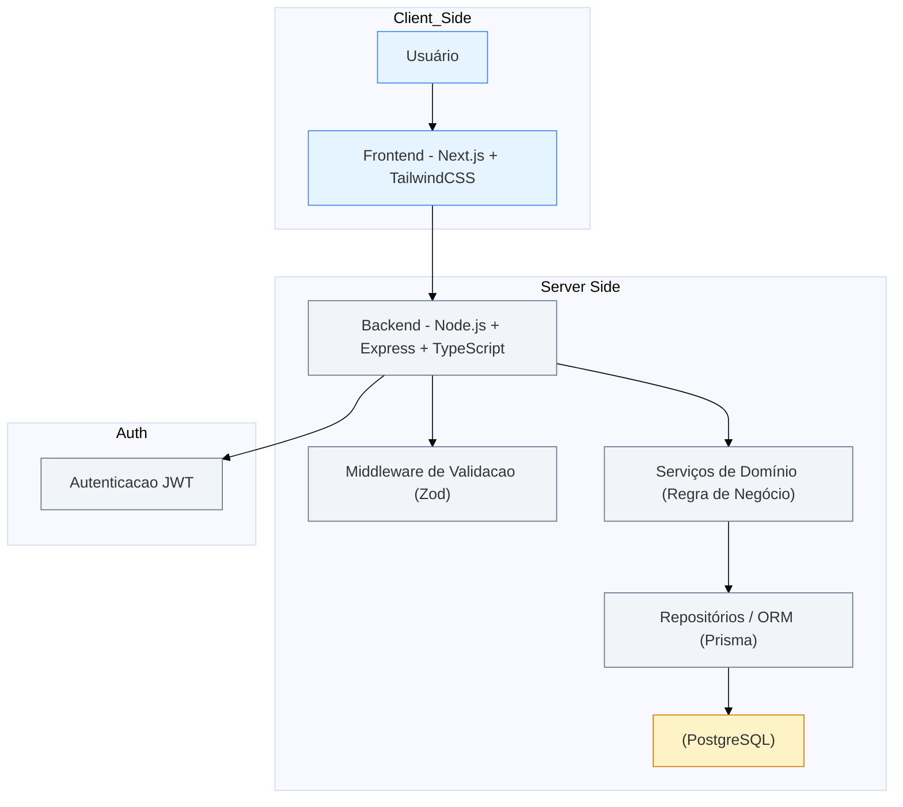

# Arquitetura — Plataforma de Gestão para Grupos de Networking

> Documento de Arquitetura para o teste técnico — Projeto: Plataforma de Gestão para Grupos de Networking

---

## Sumário

- Visão Geral
- Diagrama da Arquitetura (Mermaid)
- Escolha de tecnologias e justificativa
- Modelo de Dados (esquema relacional sugestão)
- Estrutura de Componentes (Frontend — Next.js / React)
- Definição da API (endpoints principais, request/response)
- Autenticação, autorização e segurança
- Persistência, arquivos e integrações
- Testes, CI/CD e observabilidade
- Roadmap de implementação (MVP + extras)

---

## Visão Geral

A plataforma tem como objetivo centralizar a **gestão de membros, comunicação interna, controle de presença, geração de negócios entre membros, acompanhamento de reuniões 1:1 e o módulo financeiro de mensalidades**.

A arquitetura proposta é **modular**, **escalável** e de fácil manutenção, permitindo evolução incremental e iterações rápidas.  
A solução será composta por:

- **Backend:** Node.js + Express com TypeScript
- **API:** REST (documentada com OpenAPI/Swagger)
- **Frontend:** Next.js (React) com Tailwind CSS
- **Banco de dados:** PostgreSQL (relacional)
- **Infraestrutura local:** ambiente Docker com containers para backend e banco de dados
- **Hospedagem:** frontend na Vercel e backend containerizado em ambiente cloud (ex.: Render, Railway ou ECS)

### Princípios

- **Clean Architecture e SOLID:** separação clara de camadas e responsabilidades.
- **Contratos bem definidos:** OpenAPI para comunicação padronizada entre frontend e backend.
- **Controle de acesso baseado em roles:** (admin, member, guest).
- **Modelagem relacional:** adequada ao domínio com múltiplos relacionamentos (membros, reuniões, indicações, pagamentos).
- **Testes automatizados:** unitários e de integração com Jest e Supertest.
- **Padronização visual:** uso de Tailwind CSS para consistência e manutenibilidade no frontend.
- **Validação de entradas:** via Zod, garantindo integridade e segurança nos endpoints.

---

## Diagrama da Arquitetura

---

## Escolha de Tecnologias e Justificativa

### Backend

**Node.js + Express + TypeScript**

O backend será desenvolvido com **Node.js** e **Express**, utilizando **TypeScript** para garantir tipagem estática, previsibilidade e segurança.  
A estrutura será modular, seguindo princípios de **Clean Architecture**, **SOLID** e **Domain-Driven Design (DDD)** em um nível leve, separando domínio, aplicação e infraestrutura.  
As validações serão feitas com **Zod**, e os testes com **Jest** e **Supertest** (para endpoints HTTP).

### API

**REST + OpenAPI**

A comunicação entre cliente e servidor será feita via **REST**, por ser simples, direta e de fácil documentação.  
A padronização e teste de contratos será feita através do **OpenAPI (Swagger)**, permitindo fácil inspeção e integração entre frontend e backend.

### Banco de Dados

**PostgreSQL**

O banco escolhido é o **PostgreSQL**, devido ao domínio relacional do sistema — com entidades fortemente conectadas (membros, reuniões, indicações, pagamentos).  
Principais benefícios:

- Suporte robusto a relacionamentos complexos (1:N e N:N)
- Alta integridade referencial e transacional
- Ferramentas maduras para consultas analíticas e relatórios
- Compatibilidade nativa com ORMs como Prisma

### Frontend

**Next.js (React) + Tailwind CSS**

O frontend será construído com **Next.js**, pela capacidade de renderização híbrida (SSR/SSG), roteamento simplificado e integração natural com React.  
A estilização será feita com **Tailwind CSS**, garantindo consistência visual, produtividade e fácil manutenção dos estilos.

### Autenticação

**JWT (Access + Refresh Tokens)**

O controle de autenticação será feito com **JWT**, armazenando tokens de forma segura (HTTP-only cookies).  
Haverá suporte a diferentes perfis de acesso (**admin**, **member**, **guest**).

### Testes

**Jest + Supertest + Testing Library**

- **Jest:** para testes unitários e de integração.
- **Supertest:** para simular requisições HTTP na API.
- **Testing Library (React):** para testes de interface e comportamento no frontend.

### Infraestrutura e Deploy

**Docker + Vercel + Render**

- **Ambiente local:** containerização via **Docker Compose**, com serviços de **backend** e **PostgreSQL**.
- **Deploy frontend:** realizado na **Vercel**, com integração contínua automática via Git.
- **Deploy backend:** hospedado no **Render** ou **Railway**, ambos compatíveis com containers Docker e ambientes Node.js.

---

**Justificativa Geral:**  
O conjunto de tecnologias foi escolhido visando **simplicidade, escalabilidade e clareza arquitetural**.  
O uso de **TypeScript + Tailwind + Docker + PostgreSQL** forma uma base sólida, moderna e fácil de manter, com separação clara entre camadas e possibilidade de evolução para ambientes mais complexos futuramente.

---
