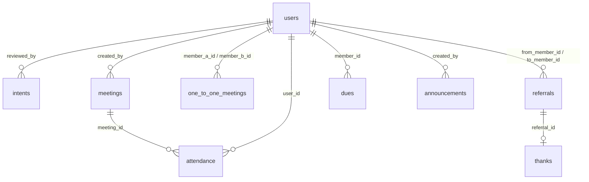

# Arquitetura — Plataforma de Gestão para Grupos de Networking

> Documento de Arquitetura para o teste técnico — Projeto: Plataforma de Gestão para Grupos de Networking

---

## Sumário

- Visão Geral
- Diagrama da Arquitetura (Mermaid)
- Escolha de tecnologias e justificativa
- Modelo de Dados (esquema relacional sugestão)
- Estrutura de Componentes (Frontend — Next.js / React)
- Definição da API (endpoints principais, request/response)
- Autenticação, autorização e segurança
- Persistência, arquivos e integrações
- Testes, CI/CD e observabilidade
- Roadmap de implementação (MVP + extras)

---

## Visão Geral

A plataforma tem como objetivo centralizar a **gestão de membros, comunicação interna, controle de presença, geração de negócios entre membros, acompanhamento de reuniões 1:1 e o módulo financeiro de mensalidades**.

A arquitetura proposta é **modular**, **escalável** e de fácil manutenção, permitindo evolução incremental e iterações rápidas.  
A solução será composta por:

- **Backend:** Node.js + Express com TypeScript
- **API:** REST (documentada com OpenAPI/Swagger)
- **Frontend:** Next.js (React) com Tailwind CSS
- **Banco de dados:** PostgreSQL (relacional)
- **Infraestrutura local:** ambiente Docker com containers para backend e banco de dados
- **Hospedagem:** frontend na Vercel e backend containerizado em ambiente cloud (ex.: Render, Railway ou ECS)

### Princípios

- **Clean Architecture e SOLID:** separação clara de camadas e responsabilidades.
- **Contratos bem definidos:** OpenAPI para comunicação padronizada entre frontend e backend.
- **Controle de acesso baseado em roles:** (admin, member, guest).
- **Modelagem relacional:** adequada ao domínio com múltiplos relacionamentos (membros, reuniões, indicações, pagamentos).
- **Testes automatizados:** unitários e de integração com Jest e Supertest.
- **Padronização visual:** uso de Tailwind CSS para consistência e manutenibilidade no frontend.
- **Validação de entradas:** via Zod, garantindo integridade e segurança nos endpoints.

---

## Diagrama da Arquitetura

---

## Escolha de Tecnologias e Justificativa

### Backend

**Node.js + Express + TypeScript**

O backend será desenvolvido com **Node.js** e **Express**, utilizando **TypeScript** para garantir tipagem estática, previsibilidade e segurança.  
A estrutura será modular, seguindo princípios de **Clean Architecture**, **SOLID** e **Domain-Driven Design (DDD)** em um nível leve, separando domínio, aplicação e infraestrutura.  
As validações serão feitas com **Zod**, e os testes com **Jest** e **Supertest** (para endpoints HTTP).

### API

**REST + OpenAPI**

A comunicação entre cliente e servidor será feita via **REST**, por ser simples, direta e de fácil documentação.  
A padronização e teste de contratos será feita através do **OpenAPI (Swagger)**, permitindo fácil inspeção e integração entre frontend e backend.

### Banco de Dados

**PostgreSQL**

O banco escolhido é o **PostgreSQL**, devido ao domínio relacional do sistema — com entidades fortemente conectadas (membros, reuniões, indicações, pagamentos).  
Principais benefícios:

- Suporte robusto a relacionamentos complexos (1:N e N:N)
- Alta integridade referencial e transacional
- Ferramentas maduras para consultas analíticas e relatórios
- Compatibilidade nativa com ORMs como Prisma

### Frontend

**Next.js (React) + Tailwind CSS**

O frontend será construído com **Next.js**, pela capacidade de renderização híbrida (SSR/SSG), roteamento simplificado e integração natural com React.  
A estilização será feita com **Tailwind CSS**, garantindo consistência visual, produtividade e fácil manutenção dos estilos.

### Autenticação

**JWT (Access + Refresh Tokens)**

O controle de autenticação será feito com **JWT**, armazenando tokens de forma segura (HTTP-only cookies).  
Haverá suporte a diferentes perfis de acesso (**admin**, **member**, **guest**).

### Testes

**Jest + Supertest + Testing Library**

- **Jest:** para testes unitários e de integração.
- **Supertest:** para simular requisições HTTP na API.
- **Testing Library (React):** para testes de interface e comportamento no frontend.

### Infraestrutura e Deploy

**Docker + Vercel + Render**

- **Ambiente local:** containerização via **Docker Compose**, com serviços de **backend** e **PostgreSQL**.
- **Deploy frontend:** realizado na **Vercel**, com integração contínua automática via Git.
- **Deploy backend:** hospedado no **Render** ou **Railway**, ambos compatíveis com containers Docker e ambientes Node.js.

---

**Justificativa Geral:**  
O conjunto de tecnologias foi escolhido visando **simplicidade, escalabilidade e clareza arquitetural**.  
O uso de **TypeScript + Tailwind + Docker + PostgreSQL** forma uma base sólida, moderna e fácil de manter, com separação clara entre camadas e possibilidade de evolução para ambientes mais complexos futuramente.

---

## Modelo de Dados (SQL)

Abaixo seguem as tabelas principais com campos essenciais e relacionamentos. Campos `created_at` e `updated_at` padronizados.

### Entidades principais

#### `users` (membros e administradores)

- `id` UUID PK
- `email` VARCHAR UNIQUE
- `password_hash` VARCHAR NULLABLE (se for local auth)
- `name` VARCHAR
- `role` ENUM('guest','member','admin')
- `phone` VARCHAR NULLABLE
- `company` VARCHAR NULLABLE
- `position` VARCHAR NULLABLE
- `status` ENUM('pending','active','rejected','inactive')
- `joined_at` TIMESTAMP NULLABLE
- `profile_photo` VARCHAR (url)
- `metadata` JSONB
- `created_at`, `updated_at`

#### `intents` (formulário público de intenção de participação)

- `id` UUID PK
- `name`, `email`, `phone`, `message` TEXT
- `source` VARCHAR (origem: site, evento)
- `status` ENUM('new','reviewed','accepted','rejected')
- `reviewed_by` FK -> users(id) NULLABLE
- `created_at`, `updated_at`

#### `meetings` (reuniões em grupo)

- `id` UUID PK
- `title`, `description`, `date` TIMESTAMP
- `location` VARCHAR NULLABLE (ou virtual link)
- `created_by` FK -> users(id)
- `created_at`, `updated_at`

#### `attendance` (check-ins)

- `id` UUID PK
- `meeting_id` FK -> meetings(id)
- `user_id` FK -> users(id)
- `status` ENUM('present','absent','late')
- `checked_at` TIMESTAMP

#### `one_to_one_meetings` (1:1 entre membros)

- `id` UUID PK
- `member_a_id` FK -> users(id)
- `member_b_id` FK -> users(id)
- `scheduled_at` TIMESTAMP
- `status` ENUM('scheduled','done','cancelled')
- `notes` TEXT

#### `referrals` (indicações / sistema de negócios)

- `id` UUID PK
- `from_member_id` FK -> users(id)
- `to_member_id` FK -> users(id) -- quem recebeu a indicação para atender
- `client_name` VARCHAR
- `description` TEXT
- `status` ENUM('open','contacted','in_progress','won','lost')
- `value_estimated` NUMERIC NULLABLE
- `closed_at` TIMESTAMP NULLABLE
- `thanks_public` BOOLEAN DEFAULT FALSE
- `created_at`, `updated_at`

#### `thanks` (agradecimentos públicos)

- `id` UUID PK
- `referral_id` FK -> referrals(id)
- `from_member_id` FK -> users(id)
- `message` TEXT
- `created_at`

#### `dues` (mensalidades)

- `id` UUID PK
- `member_id` FK -> users(id)
- `period_start` DATE
- `period_end` DATE
- `amount` NUMERIC
- `status` ENUM('pending','paid','overdue','cancelled')
- `payment_ref` VARCHAR NULLABLE
- `created_at`, `updated_at`

#### `announcements` (avisos/comunicados)

- `id` UUID PK
- `title`, `content` TEXT
- `audience` JSONB (filtros: all / groups / tags)
- `pinned` BOOLEAN
- `created_by` FK -> users(id)
- `created_at`, `updated_at`

#### `audit_logs` (opcional)

- `id`, `actor_id`, `action`, `resource_type`, `resource_id`, `payload` JSONB, `created_at`

### Índices e Relações Importantes

**Relações principais:**

- `users` 1:N `referrals` (enviadas e recebidas)
- `users` N:N `meetings` via `attendance`
- `users` 1:N `dues`
- `referrals` 1:1 `thanks`
- `users` 1:N `announcements`
- `users` N:N `one_to_one_meetings`

**Regras de integridade:**

- `ON DELETE SET NULL` — quando é importante preservar o histórico (ex.: `referrals.from_member_id`).
- `ON DELETE RESTRICT` — quando não se deve excluir o registro pai se houver dependências (ex.: `users` com mensalidades).

**Índices de performance:**

- Índice único em `users(email)` para login e autenticação.
- Índice em `referrals(status)` para filtros e relatórios.
- Índice composto em `attendance(meeting_id, user_id)` para presença e controle de duplicidade.
- Índice composto em `dues(user_id, status)` para consultas de mensalidades.
- Índice único em `thanks(referral_id)` garantindo relação 1:1 com indicações.

### Diagrama Entidade-Relacionamento (Mermaid)

